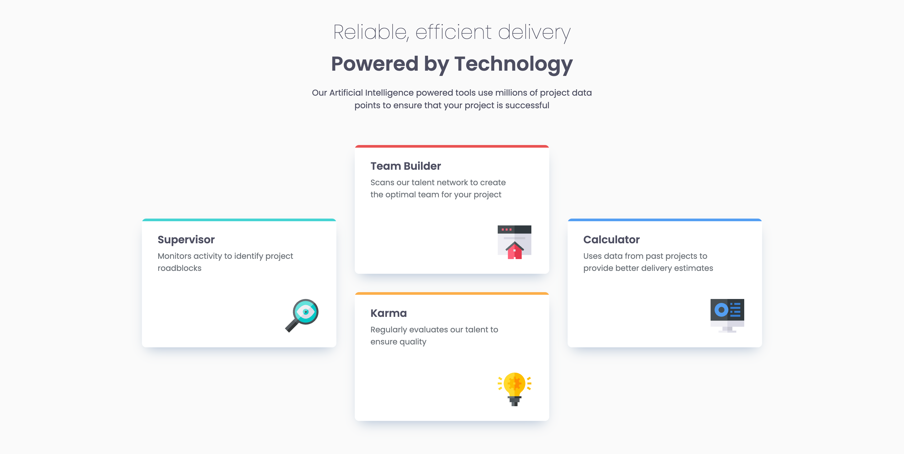
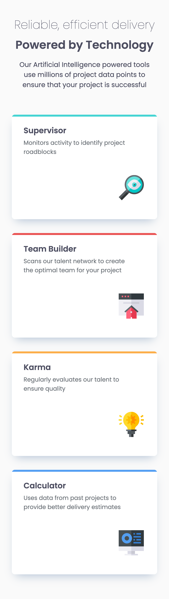

# Frontend Mentor - Four card feature section solution

This is a solution to the [Four card feature section challenge on Frontend Mentor](https://www.frontendmentor.io/challenges/four-card-feature-section-weK1eFYK). Frontend Mentor challenges help you improve your coding skills by building realistic projects. 

## Table of contents

- [Overview](#overview)
  - [The challenge](#the-challenge)
  - [Screenshot](#screenshot)
  - [Links](#links)
- [My process](#my-process)
  - [Built with](#built-with)
  - [What I learned](#what-i-learned)
  - [Continued development](#continued-development)
  - [Useful resources](#useful-resources)

## Overview

### The challenge

Users should be able to:

- View the optimal layout for the site depending on their device's screen size

### Screenshot




### Links

- Solution URL: [Solution URL link](https://github.com/henriktandberg/four-card-feature-section)
- Live Site URL: [Live site URL link](https://henriktandberg.github.io/four-card-feature-section/)

## My process

### Built with

- Semantic HTML5 markup
- CSS custom properties
- Flexbox
- CSS Grid
- Media Queries

### What I learned

The project provided a great opportunity to try my hands at CSS Grid, considering the card layout of the project.

Code example:

```css
#container {
    display: grid;
    justify-content: center;
    grid-template-rows: 140px 140px 140px 140px;
    grid-template-columns: 370px 370px 370px;
    padding: 20px;
    margin-inline: auto;
    column-gap: 35px;
}

.card-teambuilder {
    grid-row-start: 1;
    grid-row-end: 3;
    grid-column-start: 2;
    grid-column-end: 2;
}
```

The main goal of the project was to reinforce learnings about responsive design and media queries from CS50 Web, which I got to attempt. The most interesting use of it was
the CSS Grid card layout between small screens and large screens.

Code example:

```css
@media (max-width: 1167px) {

  #container {
      grid-template-rows: 300px 300px 300px 300px;
      grid-template-columns: minmax(auto, 370px);
  }

  .card-teambuilder {
      grid-row-start: 2;
      grid-row-end: 2;
      grid-column-start: 1;
      grid-column-end: 1;
  }
}
```

Other than this the project provided good practice with HTML and CSS in general, project development (From planning to development to deployment), and training my eyes
for detail, as the only design guide provided (Other than color palette, some font sizes and font family) was a few JPEG pictures of the project.

### Continued development

This was my first hand at responsive design, so naturally there is a lot more to learn. I'm looking forward to keep refining my current knowledge and skills, keep learning new concepts and becoming more concise and efficient in my code design.

### Useful resources

- ["Learn CSS Grid - A 13 Minute Deep Dive" - Slaying The Dragon](https://www.youtube.com/watch?v=EiNiSFIPIQE&list=PL2ROcs6WOvcozgQtb-iEXZVLLb1aLnXB5&index=1&ab_channel=SlayingTheDragon) - This YouTube video, in addition to Harvard's CS50's Web Programming with Python and JavaScript course, helped me understand CSS Grid properly.
- ["Master Media Queries And Responsive CSS Web Design Like a Chameleon!" - Slaying The Dragon](https://www.youtube.com/watch?v=K24lUqcT0Ms&list=PL2ROcs6WOvcozgQtb-iEXZVLLb1aLnXB5&index=2&t=310s&ab_channel=SlayingTheDragon) - Same with this resource for Media Queries. The content creator had great insights on the use of media queries.
